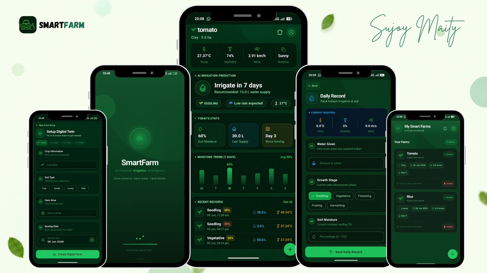

# 🌱 SmartFarm

> AI-Powered Digital Twin Agriculture Platform

SmartFarm is a modern agriculture application that combines Artificial Intelligence, Digital Twin Technology, Weather Intelligence, and Smart Irrigation Prediction to help farmers make better decisions and optimize water usage.

---

# 📸 App Showcase

---

# 🚀 About SmartFarm

SmartFarm creates a Digital Twin (virtual replica) of a real farm and continuously analyzes farm conditions, weather data, crop growth stages, and irrigation history to provide intelligent farming recommendations.

The platform helps farmers:

- Save Water
- Improve Crop Yield
- Monitor Farm Health
- Predict Irrigation Requirements
- Manage Multiple Farms Digitally

---

# ✨ Core Features

## 🌾 Digital Twin Technology

Create a virtual representation of your farm.

Each digital twin contains:

- Crop Information
- Soil Type
- Farm Area
- Sowing Date
- Daily Records

The digital twin continuously learns from farm data and improves future predictions.

---

## 🤖 AI Irrigation Prediction

SmartFarm predicts:

- When irrigation is required
- Recommended water quantity
- Future watering schedules

Predictions are generated using:

- Soil Moisture
- Temperature
- Humidity
- Wind Speed
- Crop Type
- Soil Type
- Growth Stage

---

## 🌦 Weather Intelligence

Real-time weather integration provides:

- Temperature
- Humidity
- Wind Speed

Weather conditions directly influence irrigation recommendations.

---

## 💧 Daily Farm Monitoring

Farmers can record:

- Water Supplied
- Soil Moisture
- Growth Stage
- Weather Conditions

The AI model continuously learns from these records.

---

## 📊 Smart Analytics Dashboard

The dashboard provides:

- AI Irrigation Insights
- Farm Statistics
- Moisture Trends
- Weather Overview
- Growth Monitoring
- Historical Records

---

## 🌱 Growth Stage Tracking

Supports complete crop lifecycle monitoring:

- Seedling
- Vegetative
- Flowering
- Fruiting
- Harvesting

Different stages influence irrigation recommendations.

---

## 🚜 Multi Farm Management

Manage multiple farms from a single platform.

Each farm maintains:

- Independent Digital Twin
- Separate Records
- Individual Analytics
- Unique Predictions

---

# 🎯 What Makes SmartFarm Unique?

### 🌍 Digital Twin Farming

Unlike traditional farming apps, SmartFarm creates a living digital model of the farm that evolves with every new record.

### 🧠 AI-Powered Decisions

The application analyzes environmental and crop data to generate intelligent irrigation recommendations.

### 🌦 Weather-Aware Predictions

Weather conditions automatically influence irrigation schedules.

### 📈 Data-Driven Farming

Every daily record improves future predictions.

### ♻ Sustainable Agriculture

Optimizes water usage and promotes environmentally responsible farming.

---

# 📱 Application Screens

### 🌱 Splash Screen

AI-powered agriculture introduction experience.

### 🚜 Farm List Screen

View and manage all digital farms.

### 🌾 Farm Setup Screen

Create a Digital Twin Farm in a few simple steps.

### 📊 Dashboard Screen

Monitor:

- Weather
- AI Predictions
- Farm Statistics
- Moisture Trends
- Recent Records

### 💧 Daily Record Screen

Track irrigation and soil conditions.

---

# 🛠 Tech Stack

### Android

- Kotlin
- Jetpack Compose
- Material 3
- Navigation Compose

### Architecture

- MVVM
- Clean Architecture
- StateFlow

### Dependency Injection

- Dagger Hilt

### Local Storage

- Room Database

### Networking

- Retrofit
- OpenWeather API

### Async Programming

- Kotlin Coroutines

---

# 🔮 Future Roadmap

- IoT Sensor Integration
- Crop Disease Detection
- AI Yield Prediction
- Satellite Monitoring
- Smart Notifications
- Voice Assistant
- Multi-Language Support
- Advanced Analytics

---

# 👨‍💻 Developer

### Sujoy Maity

Android Developer | AI Enthusiast

---

# ⭐ Support

If you like this project:

⭐ Star the repository

🍴 Fork the repository

📢 Share with others

---

## 🌱 Grow Smarter. Save Water. Farm Better.
